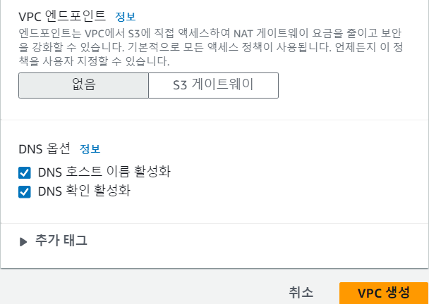
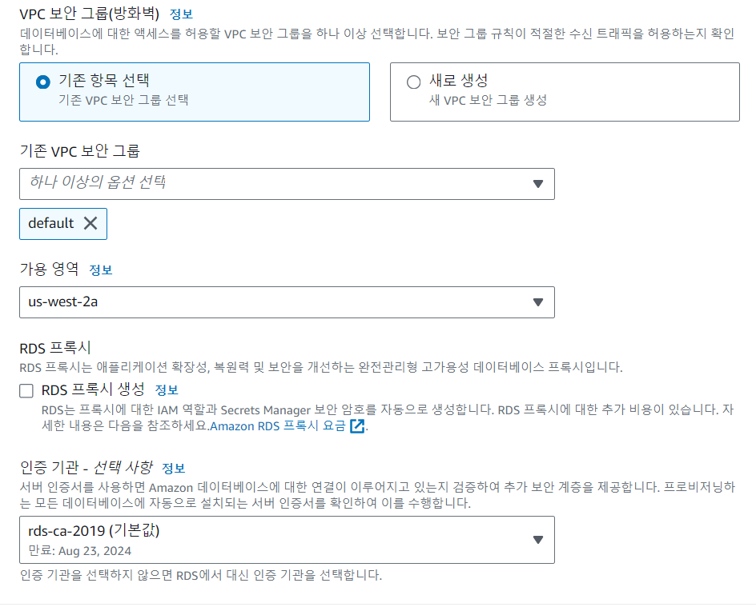

# AuctionProject

# 👖 프로젝트 3 - 중고 물품 경매 웹사이트의 클라우드 배포👖

## 목차
- [서비스 인프라 구성](#인프라구성)
- [프로젝트 구성](#프로젝트구성)
- [프론트엔드 설정 과정](##AmazonS3)
- [인스턴스 실행 및 설정 과정](#구현-페이지)
- [RDS 생성 및 설정 과정](#RDS)
- [자동배포 과정](#자동배포과정)
- [문제점 및 대응](#TroubleShooting)
- [후기](#후기)

# 인프라구성 

# 프로젝트구성
## 1. Frontend Structure


## 2. Backend Structure


## 3. AppSpec 과 Scripts
- AWS CodeDeploy에서 사용되는 appspec.yaml 파일은 배포 프로세스를 정의하는 파일입니다. 이 파일은 CodeDeploy가 어떻게 배포를 수행해야 하는지에 대한 지침을 제공합니다. 
- BeforeInstall 및 AfterInstall 단계를 사용하면 배포 프로세스의 다양한 시점에서 필요한 작업을 수행할 수 있습니다. 이를 통해 배포 중에 애플리케이션을 안정적으로 업데이트하고 추가적인 구성 작업을 처리할 수 있습니다.
## 4. workflow
- GitHub Actions은 GitHub에서 제공하는 지속적 통합 및 지속적 배포(CI/CD) 서비스입니다. Actions을 사용하여 코드를 빌드, 테스트, 패키징, 릴리스 등 여러 작업을 자동화할 수 있습니다.
- GitHub Actions에서 Workflow는 하나 이상의 Job으로 이루어진 자동화된 프로세스입니다. 각 Job은 여러 단계(Steps)으로 나누어지며, 각 단계는 하나 이상의 명령(Command)을 실행할 수 있습니다. Workflow는 특정 이벤트에 응답하여 실행되거나, 스케줄에 따라 주기적으로 실행될 수 있습니다.
# 인스턴스 실행 및 설정 과정
## VPC 생성





## 1.AmazonS3
### 1-1.Amazon S3 버킷 생성


나머지 항목은 기본값 유지 후 생성
### 1-2.정적 웹 호스팅 활성화 


### 1-3.버킷 권한에서 ACL 편집


### 1-4.React App Build
```
C:\Users\User\Downloads\miniproject3_front-main>npm install
C:\Users\User\Downloads\miniproject3_front-main>npm run build
```
### 1-5.빌드한 파일 및 폴더 S3 버킷에 업로드 

### 1-6.정적 웹 사이트 호스팅의 버킷웹사이트 엔드포인트로 접근


## 2.EC2 인스턴스 설정
### 2-1. VPC -> 보안그룹 설정 

### 2-2.인스턴스 생성


### 2-3.생성된 EC2 인스턴스의 퍼블릭IP로 SSH 프로토콜을 사용해 접속
- BITVISE를 사용해 접속한다


### 2-4.접속한 인스턴스에 필요 패키지 설치
```
ubuntu@ip-10-0-3-255:~$ sudo apt update
ubuntu@ip-10-0-3-255:~$ sudo apt -y upgrade
ubuntu@ip-10-0-3-255:~$ sudo apt install -y apache2
ubuntu@ip-10-0-3-255:~$ sudo systemctl status apache2
ubuntu@ip-10-0-3-255:~$ sudo systemctl status apache2

● apache2.service - The Apache HTTP Server
     Loaded: loaded (/lib/systemd/system/apache2.service; enabled; vendor preset: enabled)
     Active: active (running) since Wed 2023-11-22 09:37:20 UTC; 8s ago
       Docs: https://httpd.apache.org/docs/2.4/
   Main PID: 14846 (apache2)
      Tasks: 55 (limit: 1121)
     Memory: 5.0M
        CPU: 33ms
     CGroup: /system.slice/apache2.service
             ├─14846 /usr/sbin/apache2 -k start
             ├─14848 /usr/sbin/apache2 -k start
             └─14849 /usr/sbin/apache2 -k start

Nov 22 09:37:20 ip-10-0-3-255 systemd[1]: Starting The Apache HTTP Server...
Nov 22 09:37:20 ip-10-0-3-255 systemd[1]: Started The Apache HTTP Server.
```
### 2-5.PHP 설치
```
ubuntu@ip-10-0-3-255:~$ sudo apt install -y php
ubuntu@ip-10-0-3-255:~$ sudo systemctl restart apache2
ubuntu@ip-10-0-3-255:~$ sudo systemctl status apache2

● apache2.service - The Apache HTTP Server
     Loaded: loaded (/lib/systemd/system/apache2.service; enabled; vendor preset: enabled)
     Active: active (running) since Wed 2023-11-22 09:40:07 UTC; 3s ago
       Docs: https://httpd.apache.org/docs/2.4/
    Process: 21605 ExecStart=/usr/sbin/apachectl start (code=exited, status=0/SUCCESS)
   Main PID: 21609 (apache2)
      Tasks: 6 (limit: 1121)
     Memory: 10.0M
        CPU: 47ms
     CGroup: /system.slice/apache2.service
             ├─21609 /usr/sbin/apache2 -k start
             ├─21610 /usr/sbin/apache2 -k start
             ├─21611 /usr/sbin/apache2 -k start
             ├─21612 /usr/sbin/apache2 -k start
             ├─21613 /usr/sbin/apache2 -k start
             └─21614 /usr/sbin/apache2 -k start

Nov 22 09:40:07 ip-10-0-3-255 systemd[1]: Starting The Apache HTTP Server...
Nov 22 09:40:07 ip-10-0-3-255 systemd[1]: Started The Apache HTTP Server.
```
### 2-6.웹 루트 디렉터리 삭제 
```
ubuntu@ip-10-0-3-255:~$ cd /var/www/html/
ubuntu@ip-10-0-3-255:/var/www/html$ ls
index.html

ubuntu@ip-10-0-3-255:/var/www/html$ sudo rm -rf *
ubuntu@ip-10-0-3-255:/var/www/html$ ls
```
## 3.RDS
### 3-1.RDS 생성



나머지 설정은 유지하여 생성

### 3-2.RDS와 EC2인스턴스 연결 

- 작업에서 EC2인스턴스 연결 선택

### 3-3.WORKBENCH를 실행해서 RDS와 연결


### 3-4.포워딩을 통해 스키마와 테이블 설정
```sql
CREATE SCHEMA IF NOT EXISTS `auction` DEFAULT CHARACTER SET utf8mb4 COLLATE utf8mb4_0900_ai_ci ;
USE `auction` ;


-- -----------------------------------------------------
-- Table `auction`.`user`
-- -----------------------------------------------------
CREATE TABLE IF NOT EXISTS `auction`.`user` (
  `id` VARCHAR(50) NOT NULL,
  `phone` VARCHAR(50) NOT NULL,
  `password` VARCHAR(50) NOT NULL,
  `nickname` VARCHAR(50) NULL DEFAULT NULL,
  PRIMARY KEY (`id`))
ENGINE = InnoDB
DEFAULT CHARACTER SET = utf8mb4
COLLATE = utf8mb4_0900_ai_ci;


-- -----------------------------------------------------
-- Table `auction`.` history`
-- -----------------------------------------------------
CREATE TABLE IF NOT EXISTS `auction`.`history` (
  `id` int NOT NULL AUTO_INCREMENT,
  `user_id` varchar(50) NOT NULL,
  `item_id` int NOT NULL,
  PRIMARY KEY (`id`)
) ENGINE=InnoDB AUTO_INCREMENT=27 DEFAULT CHARSET=utf8mb4 COLLATE=utf8mb4_0900_ai_ci;


-- -----------------------------------------------------
-- Table `auction`.`item`
-- -----------------------------------------------------
CREATE TABLE IF NOT EXISTS `auction`.`item` (
  `id` INT NOT NULL AUTO_INCREMENT,
  `endTime` DATETIME NOT NULL,
  `startTime` DATETIME NOT NULL,
  `name` VARCHAR(100) NOT NULL,
  `content` TEXT NULL DEFAULT NULL,
  `price` DOUBLE NOT NULL,
  `user_id` VARCHAR(50) NOT NULL,
  `image` VARCHAR(200) NOT NULL,
  PRIMARY KEY (`id`),
  INDEX `fk_item_user_idx` (`user_id` ASC) VISIBLE,
  CONSTRAINT `fk_item_user`
    FOREIGN KEY (`user_id`)
    REFERENCES `auction`.`user` (`id`)
    ON DELETE CASCADE
    ON UPDATE CASCADE)
ENGINE = InnoDB
AUTO_INCREMENT = 32
DEFAULT CHARACTER SET = utf8mb4
COLLATE = utf8mb4_0900_ai_ci;


-- -----------------------------------------------------
-- Table `auction`.`prehistory`
-- -----------------------------------------------------
CREATE TABLE IF NOT EXISTS `auction`.`prehistory` (
  `id` int NOT NULL AUTO_INCREMENT,
  `user_id` varchar(50) NOT NULL,
  `item_id` int NOT NULL,
  `endTime` datetime NOT NULL,
  PRIMARY KEY (`id`),
  KEY `fk_prehistory_user1_idx` (`user_id`),
  KEY `fk_prehistory_item1_idx` (`item_id`),
  CONSTRAINT `fk_prehistory_item1` FOREIGN KEY (`item_id`) REFERENCES `item` (`id`),
  CONSTRAINT `fk_prehistory_user1` FOREIGN KEY (`user_id`) REFERENCES `user` (`id`)
)

ENGINE = InnoDB
AUTO_INCREMENT = 6
DEFAULT CHARACTER SET = utf8mb4
COLLATE = utf8mb4_0900_ai_ci;

CREATE USER 'user1'@'%' IDENTIFIED BY '1234';
GRANT ALL ON auction.* TO 'user1'@'%';
```
### 3-5.테이블 생성 확인


# 자동배포과정 
## Frontend Github Action 
React 앱은 Amazon EC2가 아닌 Amazon S3에 정적 상태로 저장하기 때문에 AWS CodeDeploy가 필요하지 않음
## 엑세스 키 생성 
### IAM에서 사용자 권한 설정 


### 보안 자격 증명에서 엑세스 키 생성


### GitAction을 위해 Front Repo에 엑세스키 등록


### GithubAction을 이용해 자동화한 과정을 작성(Frontend)
#### miniproject3_front/.github/workflows/deploy.yml
```yml
name: Deploy to Amazon S3 bucket

on:
  push:
    branches: [ "main" ]

env:
  AWS_REGION: us-west-2
  S3_BUCKET_NAME: project3-shyun-bucket
  CLOUDFRONT_NAME: E32J5G4EOKTGJR

permissions:
  contents: read
  id-token: write

jobs:
  build:
    runs-on: ubuntu-latest
    environment: production
    steps:
      - name: Checkout
        uses: actions/checkout@v3

      - name: Cache node modules
        uses: actions/cache@v3
        with:
          path: ~/.npm
          key: ${{ runner.os }}-node-${{ hashFiles('**/package-lock.json') }}

      - if: steps.npm-cache.outputs.cache-hit == 'true'
        run: echo 'npm cache hit!'
      - if: steps.npm-cache.outputs.cache-hit != 'true'
        run: echo 'npm cache missed!'

      - name: Install Dependencies
        if: steps.cache.outputs.cache-hit != 'true'
        run: npm install

      - name: Build
        run: npm run build

      - name: Remove template files
        run: rm -rf node_modules public src index.html package*

      - name: Configure AWS credentials
        uses: aws-actions/configure-aws-credentials@v1
        with:
          aws-access-key-id: ${{ secrets.AWS_ACCESS_KEY_ID }}
          aws-secret-access-key: ${{ secrets.AWS_SECRET_ACCESS_KEY }}
          aws-region: ${{ env.AWS_REGION }}

      - name: upload to S3
        run: aws s3 sync build/ s3://${{ env.S3_BUCKET_NAME }} --acl public-read
        env:
          AWS_ACCESS_KEY_ID: ${{ secrets.AWS_ACCESS_KEY_ID }}
          AWS_SECRET_ACCESS_KEY: ${{ secrets.AWS_SECRET_ACCESS_KEY }}

      - name: CloudFront delete cache
        uses: chetan/invalidate-cloudfront-action@v2
        env:
          DISTRIBUTION: ${{ env.CLOUDFRONT_NAME }}
          PATHS: "/*"
          AWS_REGION: ${{ env.AWS_REGION }}
          AWS_ACCESS_KEY_ID: ${{ secrets.AWS_ACCESS_KEY_ID }}
          AWS_SECRET_ACCESS_KEY: ${{ secrets.AWS_SECRET_ACCESS_KEY }}
```

#### GithubAction에서 자동배포 확인(Front)


### Backend의 배포 자동화를 위해 AWS CodeDeploy 생성
#### EC2 인스턴스에 CodeDeployAgent 설치
```
ubuntu@ip-10-0-3-255:/var/www/html$ sudo apt update
ubuntu@ip-10-0-3-255:/var/www/html$ sudo apt update
ubuntu@ip-10-0-3-255:/var/www/html$ sudo apt install ruby-full
ubuntu@ip-10-0-3-255:/var/www/html$ sudo apt install wget
ubuntu@ip-10-0-3-255:/var/www/html$ cd /home/ubuntu
ubuntu@ip-10-0-3-255:~$
ubuntu@ip-10-0-3-255:~$ wget https://aws-codedeploy-us-west-2.s3.us-west-2.amazonaws.com/latest/install
ubuntu@ip-10-0-3-255:~$ chmod +x ./install
ubuntu@ip-10-0-3-255:~$ sudo ./install auto
ubuntu@ip-10-0-3-255:~$ sudo service codedeploy-agent status

● codedeploy-agent.service - LSB: AWS CodeDeploy Host Agent
     Loaded: loaded (/etc/init.d/codedeploy-agent; generated)
     Active: active (running) since Wed 2023-11-22 09:48:20 UTC; 7s ago
       Docs: man:systemd-sysv-generator(8)
    Process: 22738 ExecStart=/etc/init.d/codedeploy-agent start (code=exited, status=0/SUCCESS)
      Tasks: 2 (limit: 1121)
     Memory: 57.4M
        CPU: 1.085s
     CGroup: /system.slice/codedeploy-agent.service
             ├─22744 "codedeploy-agent: master 22744" "" "" "" "" "" "" "" "" "" "" "" "" "" "" "" >
             └─22746 "codedeploy-agent: InstanceAgent::Plugins::CodeDeployPlugin::CommandPoller of >
```
### GitAction을 위해 Back Repo에 엑세스키 등록

#### CodeDeploy를 위한 AppSpec.yml 작성
#### miniproject3_back/.github/workflows/
```yml
name: Deploy to Amazon EC2

on:
  push:
    branches: [ "main" ]

env:
  AWS_REGION: us-west-2
  S3_BUCKET_NAME: project3-shyun-bucket
  CODE_DEPLOY_APPLICATION_NAME: ShyunApp
  CODE_DEPLOY_DEPLOY_GROUP_NAME: DeployGroupforShyun

permissions:
  contents: read

jobs:
  deploy:
    name: Deploy
    runs-on: ubuntu-latest
    environment: production
    steps:
    - name: Checkout
      uses: actions/checkout@v3

    - name: Configure AWS credentials
      uses: aws-actions/configure-aws-credentials@v1
      with:
        aws-access-key-id: ${{ secrets.AWS_ACCESS_KEY_ID }}
        aws-secret-access-key: ${{ secrets.AWS_SECRET_ACCESS_KEY }}
        aws-region: ${{ env.AWS_REGION }}

    - name: Upload to AWS S3
      run: |
        aws deploy push \
          --application-name ${{ env.CODE_DEPLOY_APPLICATION_NAME }} \
          --s3-location s3://$S3_BUCKET_NAME/$GITHUB_SHA.zip \
          --ignore-hidden-files \
          --source .

    - name: Deploy to AWS EC2 from S3
      run: |
        aws deploy create-deployment \
          --application-name ${{ env.CODE_DEPLOY_APPLICATION_NAME }} \
          --deployment-config-name CodeDeployDefault.AllAtOnce \
          --deployment-group-name ${{ env.CODE_DEPLOY_DEPLOY_GROUP_NAME }} \
          --s3-location bucket=$S3_BUCKET_NAME,key=$GITHUB_SHA.zip,bundleType=zip
```
#### AppSpec과 Scrtips .sh파일 작성
#### AppSpec.yml
```yml
version: 0.0
os: linux
files:
  - source: /
    destination: /home/ubuntu/ssgbay

hooks:
  BeforeInstall:
    - location: scripts/beforeInstall.sh
      runas: root
  AfterInstall:
    - location: scripts/afterInstall.sh
      runas: root
    - location: scripts/runServer.sh
      runas: ubuntu
```
#### AfterInstall.sh 작성
```sh
#!/bin/bash

cd      /home/ubuntu/ssgbay

echo    ">>> make static directory for upload images -----------------------"
mkdir   resources

echo    ">>> pip install ---------------------------------------------------"
pip     install -r requirements.txt

echo    ">>> cron settings -------------------------------------------------"
crontab -l | { cat; echo "* * * * * /usr/bin/python3 /home/ubuntu/ssgbay/historyUpdate.py >> /var/log/cron.log 2>&1"; } | crontab -

echo    ">>> remove template files -----------------------------------------"
rm      -rf  appspec.yml requirements.txt

echo    ">>> change owner to ubuntu ----------------------------------------"
chown   -R ubuntu /home/ubuntu/ssgbay
```
#### BeforeInstall.sh 작성
```sh
#!/bin/bash

var=$(ps -ef | grep 'python3 -u app.py' | grep -v 'grep')
pid=$(echo ${var} | cut -d " " -f2)
if [ -n "${pid}" ]
then 
   kill -9 ${pid}
   echo ${pid} is terminated.
else
   echo ${pid} is not running.
fi

rm -rf /home/ubuntu/ssgbay
mkdir  /home/ubuntu/ssgbay
```
#### runServer.sh 작성
```sh
#!/bin/bash

cd      /home/ubuntu/ssgbay

echo    ">>> run app -------------------------------------------------------"

cron

python3 -u app.py > /dev/null 2> /dev/null < /dev/null &
```
#### CodeDeploy 애플리케이션 생성


#### 배포그룹 생성

#### AWS CodeDeploy 배포 자동화 확인


# 문제점 및 대응 
## 배포한 인스턴스에서 RDS와 백엔드가 연결이 안된것을 확인

### database.py와 historyupdate.py의 connectionString을 수정
```
connectionString = {
    'host': 'database-1.cyu7qnoubf3u.us-west-2.rds.amazonaws.com',
    'port': 3306,
    'database': 'auction',
    'user': 'admin',
    'password': 'password',
    'charset': 'utf8',
    'cursorclass': pymysql.cursors.DictCursor
}
```
### 수정 후 재배포시 정상적으로 출력되는 현상 확인

## 배포한 애플리케이션에 접속할 수 없는 문제

### 인스턴스 내부에서 python app.py를 실행
```
ubuntu@ip-10-0-3-255:/opt/codedeploy-agent/deployment-root/2a2e556f-917b-4615-a1ff-97a1ce4c55d7/d-VTU4ZNI12/deployment-archive$ python3 app.py

Traceback (most recent call last):
  File "/opt/codedeploy-agent/deployment-root/2a2e556f-917b-4615-a1ff-97a1ce4c55d7/d-VTU4ZNI12/deployment-archive/app.py", line 5, in <module>
    from flask_jwt_extended import JWTManager
  File "/usr/local/lib/python3.10/dist-packages/flask_jwt_extended/__init__.py", line 1, in <module>
    from .jwt_manager import JWTManager as JWTManager
  File "/usr/local/lib/python3.10/dist-packages/flask_jwt_extended/jwt_manager.py", line 8, in <module>
    from jwt import DecodeError
ImportError: cannot import name 'DecodeError' from 'jwt' (/usr/local/lib/python3.10/dist-packages/jwt/__init__.py)
```
### JWT 토큰의 버전문제 
```
ubuntu@ip-10-0-3-255:/opt/codedeploy-agent/deployment-root/2a2e556f-917b-4615-a1ff-97a1ce4c55d7/d-VTU4ZNI12/deployment-archive$ pip list

PyGObject 3.42.1
PyHamcrest 2.0.2
PyJWT 2.8.0
PyMySQL 1.1.0
pyOpenSSL 21.0.0
```
### PyJWT의 버전을 변경
```
ubuntu@ip-10-0-3-255:/opt/codedeploy-agent/deployment-root/2a2e556f-917b-4615-a1ff-97a1ce4c55d7/d-G5SGOXI12/deployment-archive$ sudo pip install PyJWT==v1.7.1
```
### 정상적으로 어플리케이션 작동 확인
```
ubuntu@ip-10-0-3-255:/opt/codedeploy-agent/deployment-root/2a2e556f-917b-4615-a1ff-97a1ce4c55d7/d-G5SGOXI12/deployment-archive$ python3 app.py

- Serving Flask app 'app'
- Debug mode: off
  WARNING: This is a development server. Do not use it in a production deployment. Use a production WSGI server instead.
- Running on all addresses (0.0.0.0)
- Running on http://127.0.0.1:5000
- Running on http://10.0.3.255:5000
  Press CTRL+C to quit
```
## Frontend와 Backend가 정상적으로 연결되지 않은 현상 확인

### Frontend의 코드에서 IP연결부분이 모두 수정이 안된 현상 확인 
### 코드 수정 후 재배포 

### 정상적인 이벤트 확인


# 프로젝트 후기
- 건강에 소홀해 일정을 제대로 소화하지 못하고 짧은 시간동안 완성한 만큼 학습에 소홀한 점이 크다고 생각합니다. 
- IAM의 정책, 역할의 상관관계에 학습이 미흡한점이 아쉽다 생각합니다.
- 그에 따라, 일정관리를 실패해서 Terraform의 학습을 제대로 하지 못해 진행을 못한점을 정말 아쉽게 생각합니다.